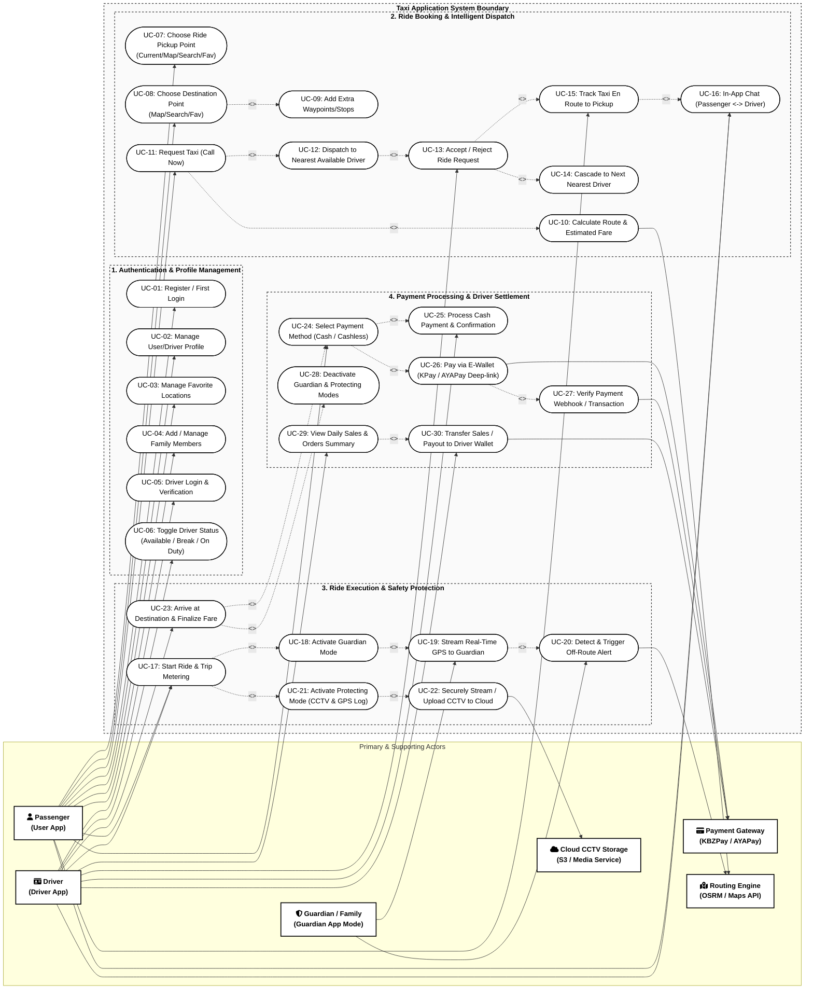
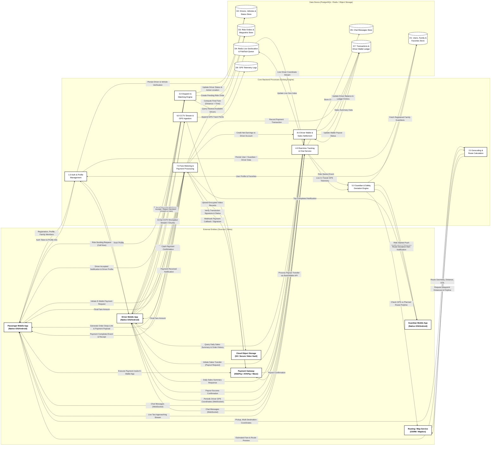
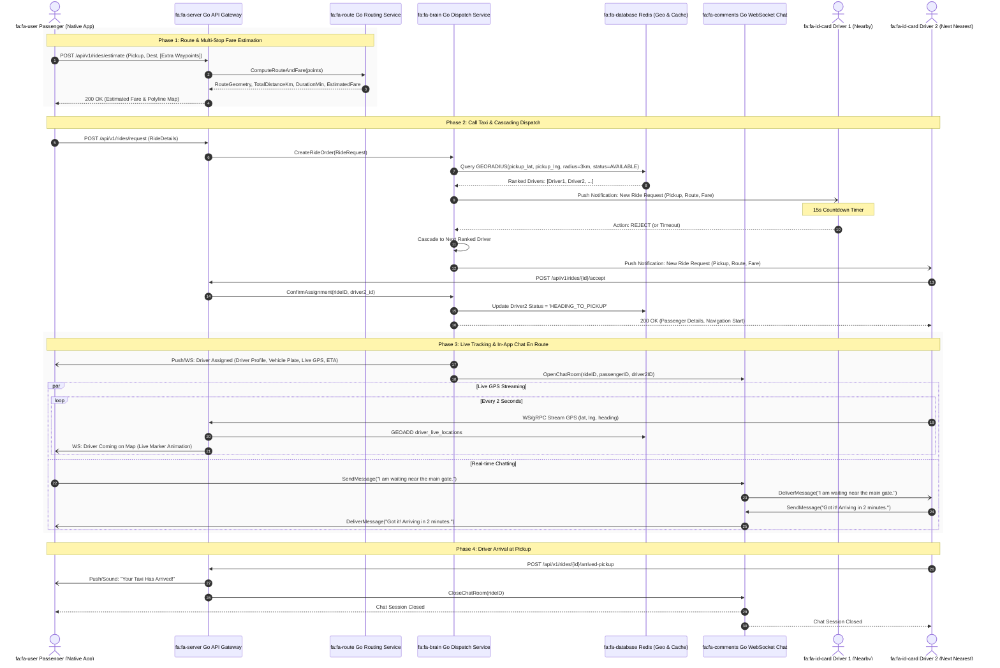
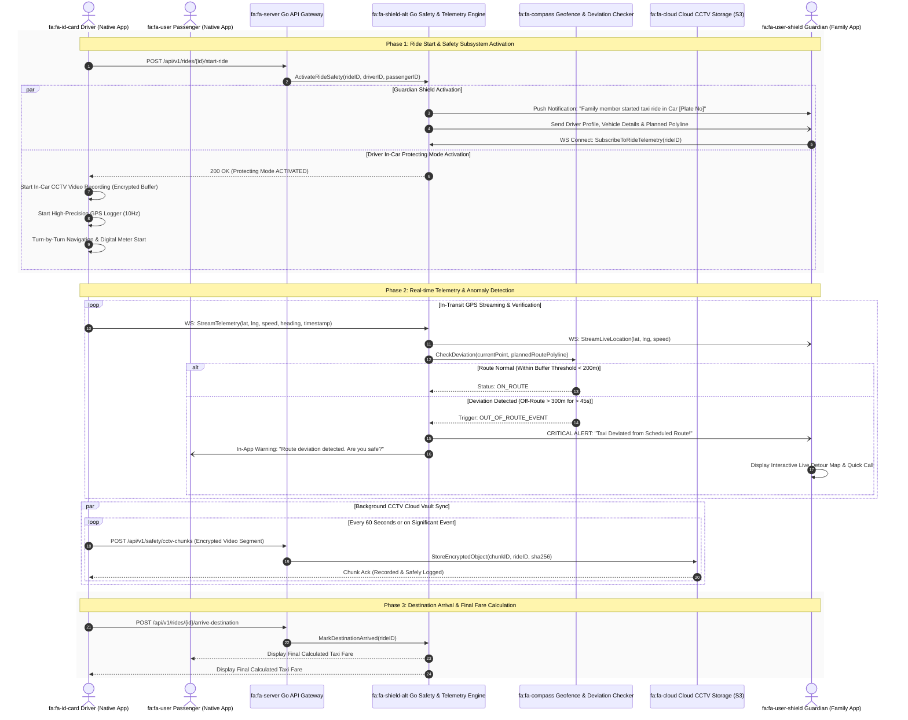
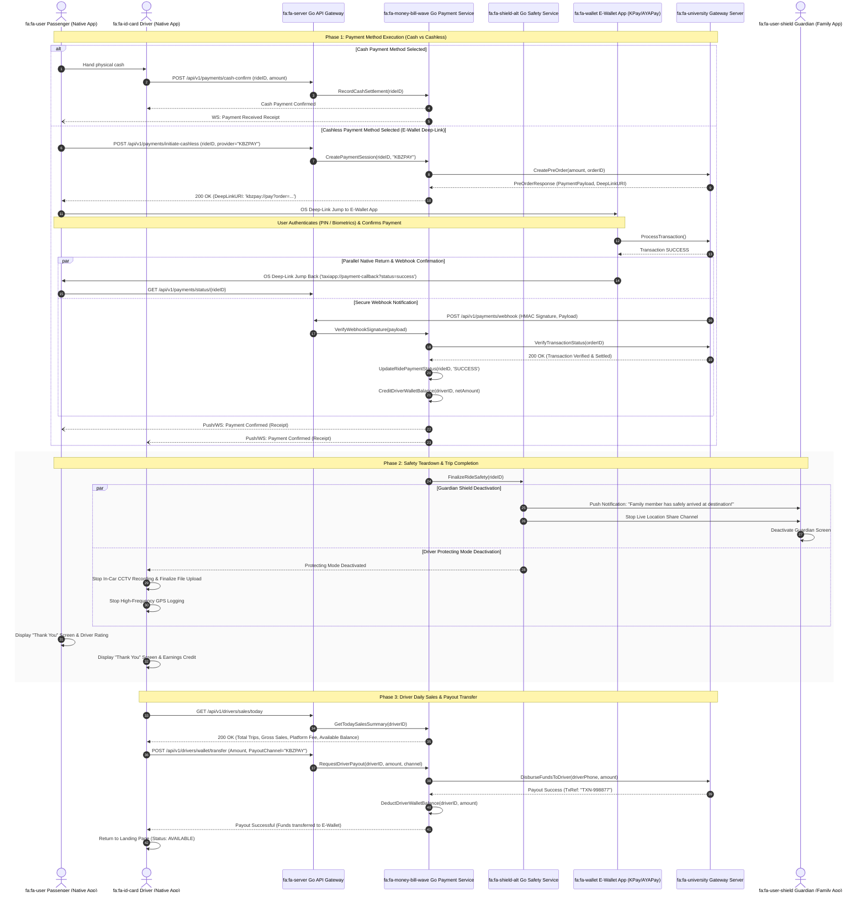
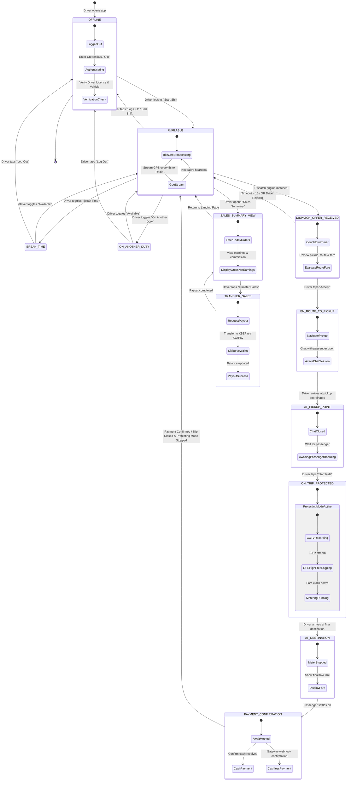

# Next-Generation Taxi Application: Architecture & UML 2.5 System Design Specification

## 1. Executive Summary & System Overview

This document presents the complete architectural blueprint and UML 2.5 specification for the **Next-Generation Taxi Application Platform**. The system is built with high concurrency, real-time safety telemetry, and instant financial settlement as top priorities.

### 1.1 Core Technological Pillars
- **Backend Core**: **Go (Golang 1.22+)** with Clean Architecture, Goroutines for concurrent geospatial processing, gRPC and WebSockets for low-latency bidirectional telemetry, and asynchronous worker pools.
- **Client Tier**: **Native Mobile Applications** (iOS via Swift 5.10 / SwiftUI and Android via Kotlin 2.0 / Jetpack Compose) for hardware-accelerated mapping, in-car CCTV video capture via AVFoundation/CameraX, and native OS deep-linking for mobile wallets.
- **Geospatial & Persistence Tier**: **PostgreSQL 16 + PostGIS** for complex spatial queries and long-term transactional records, and **Redis 7 Cluster** for real-time driver spatial indexing (`GEOADD`, `GEORADIUS`), distributed locks (`Redlock`), and Pub/Sub message dispatching.
- **Security & Safety Ecosystem**: Dual-shield safety combining **Passenger Guardian Mode** (live GPS streaming to designated family members with automated route-deviation alerts) and **Driver Protecting Mode** (automated in-car CCTV video recording, high-frequency GPS logging, and tamper-proof SHA-256 cloud archiving).
- **Payment & Financial Engine**: Hybrid multi-channel checkout supporting **Cash** and **Cashless E-Wallets** (KBZPay, AYAPay, WavePay) with cryptographic webhook verification, instant driver wallet balance crediting, and on-demand payout disbursement.

---

## 2. UML 2.5 Essential Diagrams & Flows

---

### 2.1 Use Case Diagram (UML 2.5)

The Use Case Diagram defines the interactions between human actors (**Passenger**, **Driver**, **Guardian**) and supporting systems (**Payment Gateway**, **Cloud Storage**, **Routing Engine**).



---

### 2.2 End-to-End System Process Flowchart

This flowchart illustrates the step-by-step business flow from onboarding and multi-stop booking to cascading dispatch, dual safety monitoring, and cashless wallet verification.

```mermaid
flowchart TD
    %% Global Styling Classes (Black & White UML Theme)
    classDef startEnd fill:#000000,stroke:#000000,stroke-width:2px,color:#ffffff,font-weight:bold;
    classDef process fill:#ffffff,stroke:#000000,stroke-width:1.5px,color:#000000;
    classDef decision fill:#ffffff,stroke:#000000,stroke-width:1.5px,color:#000000;
    classDef safety fill:#f5f5f5,stroke:#000000,stroke-width:2px,stroke-dasharray: 5 5,color:#000000,font-weight:bold;
    classDef external fill:#ffffff,stroke:#000000,stroke-width:2px,color:#000000;

    %% ------------------------------------------------------------------------
    %% SECTION 1: PASSENGER ONBOARDING & BOOKING
    %% ------------------------------------------------------------------------
    subgraph S1 ["1. Passenger Initialization & Booking Setup"]
        StartPassenger(["Passenger Opens App"]):::startEnd
        CheckFirstLogin{"First Time\nLogin?"}:::decision
        UserRegistration["User Registration\n(Phone, OTP, Name)"]:::process
        UserLP["User App Landing Page\n(Call Taxi, Guardian, Favorites, History, Profile)"]:::process

        SelectRidePoint["Choose Ride Pickup Point"]:::process
        RidePointSources{"Pickup Source"}:::decision
        RP_Current["Current GPS Location"]:::process
        RP_Fav["Favorite Location"]:::process
        RP_Map["Choose on Map (Pin)"]:::process
        RP_Search["Search Location Query"]:::process

        SelectDestPoint["Choose Destination Point"]:::process
        DestPointSources{"Destination Source"}:::decision
        DP_Current["Current Location"]:::process
        DP_Fav["Favorite Location"]:::process
        DP_Map["Choose on Map (Pin)"]:::process
        DP_Search["Search Location Query"]:::process

        CheckExtraStop{"Add Extra\nDestination Point?"}:::decision
        AddExtraStop["Select Extra Waypoint\n(Map / Favorite / Search)"]:::process

        CalcRouteFare["Compute Dynamic Route\n& Estimated Taxi Fare"]:::process
        DisplayRouteFare["Display Route Map\n& Estimated Taxi Fare"]:::process
        BtnCallNow(["User Taps 'Call Now'"]):::startEnd
    end

    StartPassenger --> CheckFirstLogin
    CheckFirstLogin -- "Yes" --> UserRegistration --> UserLP
    CheckFirstLogin -- "No" --> UserLP
    UserLP --> SelectRidePoint

    SelectRidePoint --> RidePointSources
    RidePointSources --> RP_Current --> SelectDestPoint
    RidePointSources --> RP_Fav --> SelectDestPoint
    RidePointSources --> RP_Map --> SelectDestPoint
    RidePointSources --> RP_Search --> SelectDestPoint

    SelectDestPoint --> DestPointSources
    DestPointSources --> DP_Current --> CheckExtraStop
    DestPointSources --> DP_Fav --> CheckExtraStop
    DestPointSources --> DP_Map --> CheckExtraStop
    DestPointSources --> DP_Search --> CheckExtraStop

    CheckExtraStop -- "Yes" --> AddExtraStop --> CheckExtraStop
    CheckExtraStop -- "No" --> CalcRouteFare --> DisplayRouteFare --> BtnCallNow

    %% ------------------------------------------------------------------------
    %% SECTION 2: DRIVER STATUS & INTELLIGENT DISPATCH
    %% ------------------------------------------------------------------------
    subgraph S2 ["2. Driver Lifecycle & Dispatch Engine"]
        DriverLogin["Driver App Login\n& Shift Verification"]:::process
        DriverStatus{"Driver Status"}:::decision
        DriverBreak["Break Time"]:::process
        DriverDuty["On Another Duty"]:::process
        DriverAvail["Available (Ready for Orders)"]:::process

        SearchDriver["Dispatch Engine: Search Nearest\nAvailable Drivers (Geohash/PostGIS)"]:::process
        NotifyDriver["Send Push & Sound Notification\nto Candidate Driver"]:::process
        DriverDecision{"Driver Accept\nor Reject?"}:::decision
        FindNextDriver["Cascade to Next Nearest\nAvailable Driver"]:::process
        NoDriverAlert["Notify Passenger:\nNo Drivers Found / Retry"]:::process

        DriverAccepted["Driver Accepts Ride Request"]:::process
        DisplayDriverInfo["Passenger App: Display Coming Taxi\n& Driver Profile (Plate, Photo, ETA)"]:::process
        TaxiEnRoute["Taxi Coming on Map (Live GPS)"]:::process
        ChatActive["In-App Chat System Activated\n(Direct Passenger <-> Driver Messaging)"]:::process
        DriverArrivedPickup["Driver Arrives at Pickup Point"]:::process
        ChatEnd["In-App Chat System Deactivated"]:::process
    end

    DriverLogin --> DriverStatus
    DriverStatus --> DriverBreak
    DriverStatus --> DriverDuty
    DriverStatus --> DriverAvail

    BtnCallNow --> SearchDriver
    DriverAvail --> SearchDriver
    SearchDriver --> NotifyDriver
    NotifyDriver --> DriverDecision
    DriverDecision -- "Reject / Timeout" --> FindNextDriver
    FindNextDriver --> DriverDecision
    FindNextDriver -- "Exhausted" --> NoDriverAlert

    DriverDecision -- "Accept" --> DriverAccepted
    DriverAccepted --> DisplayDriverInfo --> TaxiEnRoute
    TaxiEnRoute --> ChatActive --> DriverArrivedPickup --> ChatEnd

    %% ------------------------------------------------------------------------
    %% SECTION 3: RIDE EXECUTION & DUAL SAFETY SYSTEMS
    %% ------------------------------------------------------------------------
    subgraph S3 ["3. In-Transit Ride & Dual Safety Mechanisms"]
        StartRide(["Passenger Boards & Ride Starts"]):::startEnd

        %% Guardian Sub-Flow
        subgraph SubGuardian ["Guardian Safety Shield (Passenger Side)"]
            GuardianActive["Guardian Mode Activated"]:::safety
            NotifyGuardian["Send 'Ride Started' Push Notification\nto Registered Family Guardians"]:::safety
            ShareLiveLoc["Share Real-Time Live GPS Stream\n& Driver/Vehicle Info to Guardian App"]:::safety
            GuardianMonitor["Guardian Can Track Live Route & Telemetry"]:::safety
            CheckDeviation{"Taxi Out of\nDesignated Route?"}:::decision
            AlertGuardian["Trigger Instant Out-of-Route Alert\n& Push Notification to Guardian"]:::safety
        end

        %% Driver Protecting Mode
        subgraph SubProtecting ["Driver In-Car Protecting Shield"]
            ProtectActive["Driver Protecting Mode Activated"]:::safety
            StartCCTV["Start Recording In-Car CCTV Video"]:::safety
            StartGPSLog["Start High-Frequency GPS Logging"]:::safety
            StreamCloud["Stream / Buffer Encrypted Telemetry\n& Footage to Cloud Storage"]:::safety
            StartMeter["Start Digital Meter & Turn-by-Turn Navigation"]:::process
        end

        ArriveDestination(["Taxi Arrives at Final Destination"]):::startEnd
        DisplayFinalFare["Display Final Calculated Fare\non Passenger & Driver Screens"]:::process
    end

    ChatEnd --> StartRide
    DriverArrivedPickup --> StartRide

    StartRide --> GuardianActive
    GuardianActive --> NotifyGuardian --> ShareLiveLoc --> GuardianMonitor
    ShareLiveLoc --> CheckDeviation
    CheckDeviation -- "Yes" --> AlertGuardian
    CheckDeviation -- "No" --> ArriveDestination

    StartRide --> ProtectActive
    ProtectActive --> StartCCTV & StartGPSLog
    StartCCTV --> StreamCloud
    StartGPSLog --> StreamCloud
    ProtectActive --> StartMeter --> ArriveDestination

    ArriveDestination --> DisplayFinalFare

    %% ------------------------------------------------------------------------
    %% SECTION 4: PAYMENT PROCESSING & SETTLEMENT
    %% ------------------------------------------------------------------------
    subgraph S4 ["4. Payment Processing, Safety Teardown & Driver Sales"]
        PaymentChoice{"Passenger Chooses\nPayment Method"}:::decision

        %% Cash Sub-flow
        PayCash["Passenger Hands Cash to Driver"]:::process
        DriverConfirmCash["Driver Confirms Cash Received"]:::process

        %% Cashless Sub-flow
        PayCashless["Passenger Selects E-Wallet\n(KBZPay, AYAPay, WavePay)"]:::process
        JumpWallet["Native Deep-Link Jump to\nPayment Application"]:::process
        MakePayment["User Authenticates & Completes Payment"]:::external
        JumpBack["Native Deep-Link Jump Back\nto Taxi Application"]:::process
        VerifyPayment["Backend Payment Verification\n(Webhook & API Query)"]:::process
        PaymentSuccess["Payment Confirmed & Receipt Generated"]:::process

        ThankYou["Display 'Thank You' Screen\n(Rating & Digital Receipt)"]:::process

        %% Deactivation & Settlement
        StopCCTV["Stop In-Car CCTV Recording\n& Finalize Secure Cloud Upload"]:::safety
        StopGPSLog["Stop High-Frequency GPS Logging"]:::safety
        DeactivateProtect["Protecting Mode Deactivated"]:::safety

        NotifyGuardianArrived["Send 'Safely Arrived' Push Notification\nto Guardian"]:::safety
        StopLocShare["Stop Guardian Live Location Sharing"]:::safety
        DeactivateGuardian["Guardian Mode Deactivated"]:::safety

        DriverWallet["Credit Driver Balance\n(After Platform Fee Deduction)"]:::process
        DriverSalesView["Driver Views Daily Sales Summary\n& Today's Orders"]:::process
        TransferSales["Driver Initiates 'Transfer Sales'\n(Payout to Bank / E-Wallet)"]:::process
        DriverReady(["Driver Status: Available for Next Ride"]):::startEnd
    end

    DisplayFinalFare --> PaymentChoice

    PaymentChoice -- "Cash" --> PayCash --> DriverConfirmCash --> ThankYou
    PaymentChoice -- "Cashless" --> PayCashless --> JumpWallet --> MakePayment --> JumpBack --> VerifyPayment --> PaymentSuccess --> ThankYou

    ThankYou --> StopCCTV & StopGPSLog --> DeactivateProtect
    ThankYou --> NotifyGuardianArrived --> StopLocShare --> DeactivateGuardian

    DeactivateProtect --> DriverWallet --> DriverSalesView --> TransferSales --> DriverReady
    DeactivateGuardian --> DriverReady
```



---

### 2.3 Data Flow Diagram (DFD - Level 1)

The Data Flow Diagram illustrates how information moves across system boundaries, backend processes, and relational/in-memory data stores.



---

### 2.4 Entity-Relationship Diagram (ERD - Database Layout)

The relational schema implements complete referential integrity, geospatial indexing, financial double-entry tracking, and audit logging.

```mermaid
erDiagram
    %% ------------------------------------------------------------------------
    %% USER & GUARDIAN DOMAIN
    %% ------------------------------------------------------------------------
    USERS {
        uuid id PK
        string phone_number UK
        string full_name
        string email UK
        string role "passenger | driver | admin"
        string avatar_url
        boolean is_active
        timestamp created_at
        timestamp updated_at
    }

    FAVORITE_LOCATIONS {
        uuid id PK
        uuid user_id FK
        string label "Home | Work | Gym | Custom"
        string address_text
        decimal latitude
        decimal longitude
        timestamp created_at
    }

    GUARDIAN_RELATIONSHIPS {
        uuid id PK
        uuid passenger_id FK "User who rides"
        uuid guardian_id FK "User who receives alerts"
        string relationship_type "Parent | Spouse | Sibling | Friend"
        boolean is_active
        boolean notify_ride_start
        boolean notify_deviation
        timestamp created_at
    }

    %% ------------------------------------------------------------------------
    %% DRIVER & VEHICLE DOMAIN
    %% ------------------------------------------------------------------------
    DRIVERS {
        uuid id PK
        uuid user_id FK
        string license_number UK
        string national_id UK
        string status "AVAILABLE | BREAK | ON_DUTY | BUSY | OFFLINE"
        decimal current_lat
        decimal current_lng
        decimal rating_avg
        integer total_trips
        boolean is_verified
        timestamp last_status_update
        timestamp created_at
    }

    VEHICLES {
        uuid id PK
        uuid driver_id FK
        string make
        string model
        string license_plate UK
        string color
        integer manufacture_year
        string cctv_device_serial
        boolean is_active
        timestamp created_at
    }

    DRIVER_STATUS_LOGS {
        uuid id PK
        uuid driver_id FK
        string previous_status
        string new_status
        decimal latitude
        decimal longitude
        timestamp changed_at
    }

    %% ------------------------------------------------------------------------
    %% RIDE & DISPATCH DOMAIN
    %% ------------------------------------------------------------------------
    RIDES {
        uuid id PK
        uuid passenger_id FK
        uuid driver_id FK "Nullable until assigned"
        uuid vehicle_id FK "Nullable until assigned"
        string status "SEARCHING | DISPATCHED | ACCEPTED | ARRIVING | IN_TRANSIT | ARRIVED | COMPLETED | CANCELLED"
        string pickup_address
        decimal pickup_lat
        decimal pickup_lng
        string final_dest_address
        decimal final_dest_lat
        decimal final_dest_lng
        decimal estimated_distance_km
        integer estimated_duration_min
        decimal estimated_fare
        decimal actual_distance_km
        integer actual_duration_min
        decimal actual_fare
        string payment_method "CASH | CASHLESS"
        string payment_status "PENDING | SUCCESS | FAILED"
        timestamp requested_at
        timestamp accepted_at
        timestamp pickup_arrived_at
        timestamp ride_started_at
        timestamp ride_completed_at
        timestamp cancelled_at
    }

    RIDE_WAYPOINTS {
        uuid id PK
        uuid ride_id FK
        integer stop_order "1, 2, 3..."
        string address_text
        decimal latitude
        decimal longitude
        boolean is_visited
        timestamp visited_at
    }

    RIDE_DISPATCHES {
        uuid id PK
        uuid ride_id FK
        uuid driver_id FK
        string dispatch_status "PENDING | ACCEPTED | REJECTED | TIMEOUT"
        decimal driver_distance_km
        timestamp offered_at
        timestamp responded_at
        timestamp timeout_at
    }

    %% ------------------------------------------------------------------------
    %% COMMUNICATION & SAFETY DOMAIN
    %% ------------------------------------------------------------------------
    CHAT_MESSAGES {
        uuid id PK
        uuid ride_id FK
        uuid sender_id FK
        uuid recipient_id FK
        string message_type "TEXT | IMAGE | SYSTEM"
        string content
        boolean is_read
        timestamp sent_at
        timestamp read_at
    }

    GPS_TELEMETRY_LOGS {
        uuid id PK
        uuid ride_id FK
        uuid driver_id FK
        decimal latitude
        decimal longitude
        decimal speed_kmh
        decimal heading_deg
        decimal accuracy_meters
        timestamp recorded_at
    }

    CCTV_RECORDINGS {
        uuid id PK
        uuid ride_id FK
        uuid vehicle_id FK
        string storage_file_key
        string cloud_storage_url
        bigint file_size_bytes
        integer duration_seconds
        string hash_sha256
        string encryption_algorithm
        string status "RECORDING | UPLOADING | ARCHIVED"
        timestamp recorded_from
        timestamp recorded_to
    }

    SAFETY_ALERTS {
        uuid id PK
        uuid ride_id FK
        uuid triggered_by FK
        string alert_type "OUT_OF_ROUTE | PANIC_BUTTON | PROLONGED_STOP"
        decimal deviation_distance_meters
        decimal current_lat
        decimal current_lng
        string status "TRIGGERED | ACKNOWLEDGED | RESOLVED"
        timestamp created_at
        timestamp resolved_at
    }

    %% ------------------------------------------------------------------------
    %% PAYMENT & FINANCIAL SETTLEMENT DOMAIN
    %% ------------------------------------------------------------------------
    PAYMENTS {
        uuid id PK
        uuid ride_id FK
        uuid passenger_id FK
        decimal amount
        string currency "MMK | USD"
        string payment_method "CASH | CASHLESS"
        string gateway_provider "KBZPAY | AYAPAY | WAVEPAY | CASH"
        string transaction_ref UK
        string payment_payload_json
        string status "INITIATED | AUTHORIZED | SETTLED | FAILED"
        timestamp verified_at
        timestamp created_at
    }

    DRIVER_WALLETS {
        uuid id PK
        uuid driver_id FK UK
        decimal total_earned
        decimal available_balance
        decimal pending_balance
        string currency "MMK | USD"
        timestamp updated_at
    }

    DRIVER_PAYOUTS {
        uuid id PK
        uuid wallet_id FK
        uuid driver_id FK
        decimal amount
        string payout_channel "KBZPAY | AYAPAY | BANK_TRANSFER"
        string account_number
        string transaction_ref UK
        string status "PENDING | PROCESSING | COMPLETED | REJECTED"
        timestamp requested_at
        timestamp processed_at
    }

    %% Relationships
    USERS ||--o{ FAVORITE_LOCATIONS : "defines"
    USERS ||--o{ GUARDIAN_RELATIONSHIPS : "has family guardians"
    USERS ||--o{ GUARDIAN_RELATIONSHIPS : "acts as guardian for"
    USERS ||--o| DRIVERS : "registers as"
    USERS ||--o{ RIDES : "requests"
    USERS ||--o{ CHAT_MESSAGES : "sends"
    USERS ||--o{ PAYMENTS : "pays"

    DRIVERS ||--o{ VEHICLES : "operates"
    DRIVERS ||--o{ DRIVER_STATUS_LOGS : "logs status transitions"
    DRIVERS ||--o{ RIDES : "executes"
    DRIVERS ||--o{ RIDE_DISPATCHES : "receives offers"
    DRIVERS ||--o| DRIVER_WALLETS : "owns"
    DRIVERS ||--o{ DRIVER_PAYOUTS : "requests"
    DRIVERS ||--o{ GPS_TELEMETRY_LOGS : "streams telemetry"

    RIDES ||--o{ RIDE_WAYPOINTS : "contains ordered"
    RIDES ||--o{ RIDE_DISPATCHES : "generates dispatch rounds"
    RIDES ||--o{ CHAT_MESSAGES : "contextualizes"
    RIDES ||--o{ GPS_TELEMETRY_LOGS : "tracks route points"
    RIDES ||--o{ CCTV_RECORDINGS : "secures with"
    RIDES ||--o{ SAFETY_ALERTS : "monitors for"
    RIDES ||--|| PAYMENTS : "settles with"

    VEHICLES ||--o{ RIDES : "assigned to"
    VEHICLES ||--o{ CCTV_RECORDINGS : "captures"

    DRIVER_WALLETS ||--o{ DRIVER_PAYOUTS : "disburses funds via"
```

---

### 2.5 Class & Domain Architecture Diagram (Go & Native Mobile)

This diagram details the clean architecture mapping across Domain Entities, Golang Use Cases, Repositories, and Native Mobile ViewModels.

```mermaid
classDiagram
    %% Domain Entities
    class User {
        +UUID ID
        +string PhoneNumber
        +string FullName
        +string Role
        +bool IsActive
        +time.Time CreatedAt
        +GetGuardians() List~User~
        +AddFavorite(FavoriteLocation) error
    }

    class Driver {
        +UUID ID
        +UUID UserID
        +string LicenseNumber
        +DriverStatus Status
        +GeoPoint CurrentLocation
        +float64 Rating
        +bool IsAvailable() bool
        +UpdateStatus(DriverStatus) error
    }

    class Vehicle {
        +UUID ID
        +UUID DriverID
        +string Make
        +string Model
        +string LicensePlate
        +string CCTVDeviceID
    }

    class Ride {
        +UUID ID
        +UUID PassengerID
        +UUID DriverID
        +RideStatus Status
        +GeoPoint PickupLocation
        +GeoPoint DestinationLocation
        +List~Waypoint~ Waypoints
        +FareEstimate EstimatedFare
        +FareActual ActualFare
        +PaymentMethod Method
        +PaymentStatus PaymentStatus
        +CalculateFare(km, min) Money
        +AddWaypoint(GeoPoint) error
        +StartTrip() error
        +CompleteTrip() error
    }

    class Waypoint {
        +UUID ID
        +UUID RideID
        +int OrderIndex
        +string Address
        +GeoPoint Location
        +bool IsVisited
    }

    class ChatMessage {
        +UUID ID
        +UUID RideID
        +UUID SenderID
        +UUID RecipientID
        +string Content
        +time.Time SentAt
    }

    class SafetySession {
        +UUID ID
        +UUID RideID
        +bool GuardianModeActive
        +bool ProtectingModeActive
        +GeoPolyline PlannedRoute
        +StartCCTVLogging() error
        +CheckDeviation(GeoPoint) bool
        +TriggerAlert(AlertType) error
    }

    class PaymentTransaction {
        +UUID ID
        +UUID RideID
        +UUID PayerID
        +Money Amount
        +PaymentProvider Provider
        +TransactionStatus Status
        +string TransactionRef
        +VerifySignature() bool
    }

    class DriverWallet {
        +UUID ID
        +UUID DriverID
        +Money Balance
        +Money PendingBalance
        +Credit(Money) error
        +RequestPayout(Money, PayoutChannel) PayoutRequest
    }

    %% Service Interfaces
    class RideUseCase {
        <<interface>>
        +EstimateRide(ctx, req EstimateRequest) (EstimateResponse, error)
        +RequestRide(ctx, req BookingRequest) (Ride, error)
        +DispatchNextDriver(ctx, rideID UUID) (Driver, error)
        +AcceptRide(ctx, rideID, driverID UUID) error
        +RejectRide(ctx, rideID, driverID UUID) error
        +StartRide(ctx, rideID UUID) error
        +CompleteRide(ctx, rideID UUID) (FareSummary, error)
    }

    class SafetyUseCase {
        <<interface>>
        +ActivateGuardianMode(ctx, rideID UUID) error
        +BroadcastGPS(ctx, rideID UUID, pt GeoPoint) error
        +EvaluateRouteDeviation(ctx, rideID UUID, pt GeoPoint) (bool, error)
        +StartProtectingMode(ctx, rideID, vehicleID UUID) error
        +UploadCCTVChunk(ctx, rideID UUID, chunk io.Reader) error
        +DeactivateSafety(ctx, rideID UUID) error
    }

    class PaymentUseCase {
        <<interface>>
        +InitiateCashlessPayment(ctx, rideID UUID, provider PaymentProvider) (DeepLinkResult, error)
        +HandlePaymentWebhook(ctx, payload WebhookData) error
        +ConfirmCashPayment(ctx, rideID, driverID UUID) error
        +GetDailySalesSummary(ctx, driverID UUID, date time.Time) (SalesSummary, error)
        +DisburseDriverPayout(ctx, driverID UUID, amount Money) (PayoutResult, error)
    }

    class ChatUseCase {
        <<interface>>
        +SendMessage(ctx, msg ChatMessage) error
        +GetRideChatHistory(ctx, rideID UUID) (List~ChatMessage~, error)
        +CloseChatSession(ctx, rideID UUID) error
    }

    %% Repository Interfaces
    class RideRepository {
        <<interface>>
        +Create(ctx, ride Ride) error
        +FindByID(ctx, id UUID) (Ride, error)
        +UpdateStatus(ctx, id UUID, status RideStatus) error
        +FindNearbyAvailableDrivers(ctx, pt GeoPoint, radiusKm float64) (List~Driver~, error)
    }

    class DriverWalletRepository {
        <<interface>>
        +GetByDriverID(ctx, driverID UUID) (DriverWallet, error)
        +UpdateBalanceAtomic(ctx, driverID UUID, amount Money) error
        +CreatePayout(ctx, payout PayoutRequest) error
    }

    %% Native Mobile ViewModels
    class PassengerViewModel {
        +RideState CurrentRideState
        +LocationData CurrentLocation
        +FareEstimate EstimatedFare
        +SelectPickup(GeoPoint)
        +AddDestinationWaypoint(GeoPoint)
        +CallTaxi()
        +SelectPaymentMethod(Method)
    }

    class DriverViewModel {
        +DriverStatus CurrentStatus
        +DispatchOffer PendingOffer
        +SalesSummary TodaySales
        +ToggleStatus(DriverStatus)
        +AcceptBooking(rideID)
        +StartMeterNavigation()
        +ConfirmCashReceived()
        +TransferSales()
    }

    class GuardianViewModel {
        +List~FamilyMember~ TrackedMembers
        +GeoPoint LiveDriverLocation
        +Polyline PlannedRoute
        +bool DeviationAlertActive
        +SubscribeToLiveStream(rideID)
        +DismissAlert()
    }

    class NativeCCTVManager {
        +CameraCaptureSession CaptureSession
        +GPSLogger HighFrequencyLogger
        +StartRecording()
        +StreamEncryptedChunks()
        +StopRecording()
    }

    %% Relationships
    User "1" -- "0..*" Waypoint : creates
    User "1" -- "0..1" Driver : profile
    Driver "1" -- "1" Vehicle : operates
    Driver "1" -- "1" DriverWallet : manages

    Ride "1" *-- "1..*" Waypoint : contains
    Ride "1" -- "1" User : booked_by
    Ride "1" -- "0..1" Driver : assigned_to
    Ride "1" -- "1" SafetySession : monitors
    Ride "1" -- "0..*" ChatMessage : contains
    Ride "1" -- "1" PaymentTransaction : settles_with

    RideUseCase ..|> Ride : orchestrates
    SafetyUseCase ..|> SafetySession : manages
    PaymentUseCase ..|> PaymentTransaction : verifies
    PaymentUseCase ..|> DriverWallet : credits
    ChatUseCase ..|> ChatMessage : routes

    RideUseCase --> RideRepository : uses
    PaymentUseCase --> DriverWalletRepository : uses

    PassengerViewModel ..> RideUseCase : calls API/WS
    DriverViewModel ..> RideUseCase : calls API/WS
    DriverViewModel ..> PaymentUseCase : initiates payout
    DriverViewModel ..> NativeCCTVManager : controls
    GuardianViewModel ..> SafetyUseCase : subscribes WS
```



---

### 2.6 Sequence Diagrams

#### 2.6.1 Ride Booking, Multi-Stop Fare Estimation, Driver Dispatch & In-App Chat



---

#### 2.6.2 In-Transit Guardian Shield & CCTV Protecting Mode



---

#### 2.6.3 Payment Processing, Deep-Linking, Safety Teardown & Driver Sales Payout



---

### 2.7 Component & System Architecture Diagram

```mermaid
flowchart TB
    %% Global Styling Classes (Black & White UML Theme)
    classDef clientTier fill:#ffffff,stroke:#000000,stroke-width:2px,color:#000000;
    classDef gatewayTier fill:#f9f9f9,stroke:#000000,stroke-width:2px,color:#000000,font-weight:bold;
    classDef serviceTier fill:#ffffff,stroke:#000000,stroke-width:1.5px,color:#000000;
    classDef dataTier fill:#ffffff,stroke:#000000,stroke-width:2px,stroke-dasharray: 4 2,color:#000000;
    classDef externalTier fill:#ffffff,stroke:#000000,stroke-width:2px,stroke-dasharray: 2 2,color:#000000;

    %% 1. Client Tier
    subgraph TierClients ["1. Client Tier (Native iOS Swift & Android Kotlin)"]
        direction LR
        subgraph AppPassenger ["Passenger Native Mobile App"]
            P_UI["SwiftUI / Jetpack Compose UI"]
            P_Location["CoreLocation / FusedLocation"]
            P_PayLink["Deep-Link Payment Handler"]
        end

        subgraph AppDriver ["Driver Native Mobile App"]
            D_UI["Driver UI & Shift Controller"]
            D_CCTV["CCTV Hardware / CameraX Engine"]
            D_GPSLog["High-Precision GPS Telemetry"]
            D_Wallet["Sales Summary & Payout UI"]
        end

        subgraph AppGuardian ["Guardian Native Mobile View"]
            G_UI["Family Tracking Map UI"]
            G_Alert["Emergency Alert Receiver"]
        end
    end

    %% 2. Edge Gateway
    subgraph TierGateway ["2. Edge & API Gateway Tier"]
        APIGateway["Go API Gateway & Reverse Proxy\n- TLS 1.3 Termination\n- JWT Claims & Auth Verification\n- Rate Limiting & Request Throttling\n- WebSocket / gRPC Connection Multiplexer"]:::gatewayTier
    end

    %% 3. Application Tier
    subgraph TierServices ["3. Go Backend Core Application Tier (Clean Architecture)"]
        direction TB
        subgraph SvcAuth ["Auth & User Service"]
            S_User["User & Driver Profile Manager"]
            S_Family["Family / Guardian Relation Manager"]
        end

        subgraph SvcDispatch ["Ride & Dispatch Engine"]
            S_Route["Multi-Stop Route & Fare Estimator"]
            S_Matching["Spatial Matchmaker & Driver Cascader"]
            S_RideState["Ride Lifecycle State Machine"]
        end

        subgraph SvcRealtime ["Real-Time & Telemetry Hub"]
            S_WSHub["WebSocket Connection Hub"]
            S_Chat["In-App Chat Router"]
            S_GPSIngest["GPS Stream Processor"]
        end

        subgraph SvcSafety ["Safety & CCTV Ingestion Service"]
            S_Geofence["Route Deviation & Geofence Engine"]
            S_CCTVUpload["Encrypted CCTV Chunk Ingester"]
            S_AlertRouter["Emergency Alert Dispatcher"]
        end

        subgraph SvcBilling ["Payment & Driver Wallet Service"]
            S_PayGateway["E-Wallet Deep-Link & Webhook Handler"]
            S_CashConfirm["Cash Settlement Handler"]
            S_Ledger["Driver Wallet Ledger & Payout Engine"]
        end

        subgraph SvcNotify ["Notification Worker"]
            S_Push["Push Notification Dispatcher (APNs / FCM)"]
        end
    end

    %% 4. Data & Persistence Tier
    subgraph TierData ["4. Persistence, Cache & Storage Tier"]
        direction LR
        DB_Postgres[("PostgreSQL 16 + PostGIS\n- Users, Guardians, Drivers\n- Rides, Waypoints, Ledger\n- Spatial Indexes (GIST)")]:::dataTier
        Cache_Redis[("Redis 7 Cluster\n- Geospatial Index (GEOADD/GEORADIUS)\n- Pub/Sub Message Bus\n- Distributed Locks (Redlock)")]:::dataTier
        Storage_S3[("Encrypted Cloud Object Storage (S3)\n- CCTV Video Chunks & Hashes\n- Driver License & ID Documents\n- Digital Payment Receipts")]:::dataTier
    end

    %% 5. External Tier
    subgraph TierExternal ["5. External Services & Payment Gateways"]
        direction LR
        Ext_Map["Routing / Map API\n(OSRM / Mapbox)"]:::externalTier
        Ext_Payment["E-Wallets (KBZPay / AYAPay / WavePay)"]:::externalTier
        Ext_Push["Push Notification Services (Apple APNs / Google FCM)"]:::externalTier
    end

    %% Client Connections
    AppPassenger -->|"HTTPS / WSS"| APIGateway
    AppDriver -->|"HTTPS / WSS / gRPC"| APIGateway
    AppGuardian -->|"HTTPS / WSS"| APIGateway

    %% Gateway to Services
    APIGateway --> SvcAuth
    APIGateway --> SvcDispatch
    APIGateway --> SvcRealtime
    APIGateway --> SvcSafety
    APIGateway --> SvcBilling

    %% Inter-service
    S_Matching -->|"Query Nearby"| Cache_Redis
    S_GPSIngest -->|"Publish Location"| Cache_Redis
    Cache_Redis -->|"Consume Stream"| S_WSHub
    S_GPSIngest -->|"Feed Coords"| S_Geofence
    S_Geofence -->|"Trigger Alert"| S_AlertRouter
    S_AlertRouter -->|"Send Push"| S_Push
    S_PayGateway -->|"Credit Earnings"| S_Ledger

    %% Persistence
    S_User & S_Family --> DB_Postgres
    S_Route & S_RideState --> DB_Postgres
    S_Chat & S_GPSIngest --> DB_Postgres
    S_Ledger & S_CashConfirm --> DB_Postgres
    S_CCTVUpload --> Storage_S3

    %% External
    S_Route --> Ext_Map
    S_Geofence --> Ext_Map
    S_PayGateway --> Ext_Payment
    S_Ledger --> Ext_Payment
    S_Push --> Ext_Push
```



---

### 2.8 State Machine Diagrams (UML 2.5)

#### 2.8.1 Ride Order Lifecycle State Machine

```mermaid
stateDiagram-v2
    [*] --> DRAFT : User opens Call Taxi screen

    state DRAFT {
        [*] --> SelectingPickup
        SelectingPickup --> SelectingDestination : Pickup confirmed
        SelectingDestination --> AddingExtraStops : Add extra waypoint
        AddingExtraStops --> SelectingDestination : Stop added
        SelectingDestination --> EstimatingFare : Waypoints finalized
        EstimatingFare --> FareCalculated : Route polyline & Fare ready
    }

    DRAFT --> SEARCHING : User taps "Call Now" / lock estimated fare
    DRAFT --> CANCELLED : User discards booking

    state SEARCHING {
        [*] --> RadiusSearch
        RadiusSearch --> DriverEvaluation : Query Redis PostGIS
        DriverEvaluation --> DispatchOffer : Candidate driver found
    }

    SEARCHING --> DISPATCHED : Push offer to candidate driver

    state DISPATCHED {
        [*] --> OfferPending
        OfferPending --> OfferTimeout : Timer > 15 seconds
        OfferPending --> DriverRejected : Driver taps Reject
    }

    DISPATCHED --> SEARCHING : [Driver rejected OR Timeout] / Cascade to next driver
    SEARCHING --> NO_DRIVER_FOUND : [All nearby drivers exhausted]
    NO_DRIVER_FOUND --> [*] : Notify user to retry

    DISPATCHED --> DRIVER_ACCEPTED : Driver taps Accept

    state DRIVER_ACCEPTED {
        [*] --> InitChatSession
        InitChatSession --> EnRoutePickup : Open WebSocket & map stream
    }

    DRIVER_ACCEPTED --> ARRIVED_AT_PICKUP : Driver reaches pickup coordinates / tap "Arrived"

    state ARRIVED_AT_PICKUP {
        [*] --> CloseChat
        CloseChat --> WaitingPassenger : Push notification to passenger
    }

    ARRIVED_AT_PICKUP --> IN_TRANSIT : Driver taps "Start Ride" / Passenger boards

    state IN_TRANSIT {
        [*] --> DualSafetyActive
        state DualSafetyActive {
            [*] --> MonitoringRoute
            MonitoringRoute --> DeviationAlert : [GPS offset > 300m] / Alert Guardian
            DeviationAlert --> MonitoringRoute : Resolved / Back on track
        }
        --
        state MeteringAndCCTV {
            [*] --> LoggingGPSAndVideo
            LoggingGPSAndVideo --> ChunkCloudSync : Every 60s
            ChunkCloudSync --> LoggingGPSAndVideo
        }
    }

    IN_TRANSIT --> ARRIVED_AT_DESTINATION : Driver taps "Arrived Destination"

    state ARRIVED_AT_DESTINATION {
        [*] --> CalculateFinalFare
        CalculateFinalFare --> AwaitingPaymentChoice : Fare displayed on both apps
    }

    ARRIVED_AT_DESTINATION --> PAYMENT_PROCESSING : Passenger selects Cash or Cashless

    state PAYMENT_PROCESSING {
        [*] --> PaymentFork
        PaymentFork --> CashFlow : Cash chosen
        CashFlow --> CashConfirmed : Driver confirms cash receipt

        PaymentFork --> CashlessFlow : E-Wallet chosen (KPay/AYAPay)
        CashlessFlow --> DeepLinkWallet : Launch Native E-Wallet
        DeepLinkWallet --> WebhookVerification : Gateway webhook received
        WebhookVerification --> CashlessSettled : Signature verified & funds captured
    }

    PAYMENT_PROCESSING --> COMPLETED : Payment settled

    state COMPLETED {
        [*] --> TeardownSafety
        TeardownSafety --> DeactivateGuardian : Notify Guardian "Safely Arrived"
        TeardownSafety --> DeactivateCCTV : Stop video & log final metadata
        DeactivateGuardian --> DisplayThankYou : Digital receipt generated
        DeactivateCCTV --> DisplayThankYou
    }

    COMPLETED --> [*] : Ride archived & Driver wallet credited

    %% Global Cancellations
    SEARCHING --> CANCELLED : Passenger cancels request
    DRIVER_ACCEPTED --> CANCELLED : Passenger/Driver cancels with penalty
    CANCELLED --> [*] : State persisted & resources released
```



---

#### 2.8.2 Driver Operational Status & Shift State Machine



---

#### 2.8.3 Guardian & CCTV Safety Subsystem State Machine

```mermaid
stateDiagram-v2
    [*] --> SAFETY_STANDBY : Family relationship registered

    state SAFETY_STANDBY {
        [*] --> InactiveSession
        InactiveSession --> AwaitRideStart : Listening for family ride events
    }

    SAFETY_STANDBY --> DUAL_PROTECTION_ENGAGED : Ride Start Event Triggered

    state DUAL_PROTECTION_ENGAGED {
        %% Guardian Subsystem
        state GuardianSubsystem {
            [*] --> GuardianNotified
            GuardianNotified --> LiveLocationSharing : Send Driver & Vehicle metadata

            state LiveLocationSharing {
                [*] --> OnRouteNormal
                OnRouteNormal --> RouteDeviationAlert : [Distance to planned route > 300m]
                RouteDeviationAlert --> OnRouteNormal : [Vehicle returns to route]
                RouteDeviationAlert --> EmergencyEscalation : [No correction after 2 mins / SOS pressed]
                EmergencyEscalation --> LawEnforcementDispatch : High-priority safety response
            }
        }
        --
        %% Driver In-Car Protecting Subsystem
        state ProtectingCCTVSubsystem {
            [*] --> HardwareInit
            HardwareInit --> CCTVRecordingActive : Camera capture pipeline engaged

            state CCTVRecordingActive {
                [*] --> ChunkBuffering
                ChunkBuffering --> EncryptedCloudSync : Every 60s chunk / 1080p
                EncryptedCloudSync --> ChunkBuffering : Chunk uploaded & SHA-256 hashed
            }
        }
    }

    DUAL_PROTECTION_ENGAGED --> TRIP_DESTINATION_ARRIVED : Destination coordinates reached

    state TRIP_DESTINATION_ARRIVED {
        [*] --> AwaitPaymentSettlement
        AwaitPaymentSettlement --> SafetyShutdownInitiated : Payment confirmed
    }

    TRIP_DESTINATION_ARRIVED --> SAFETY_TEARDOWN : Finalize ride completion

    state SAFETY_TEARDOWN {
        [*] --> FinalizeGuardian
        FinalizeGuardian --> SendArrivalPush : "Family member safely arrived"
        SendArrivalPush --> CloseLocationStream : Kill WebSocket channel

        [*] --> FinalizeCCTV
        FinalizeCCTV --> FlushRemainingVideoBuffer : Upload final segment
        FlushRemainingVideoBuffer --> SealTripRecord : Generate SHA-256 integrity digest
        SealTripRecord --> StopCCTVHardware : Release camera & GPS resources
    }

    SAFETY_TEARDOWN --> SAFETY_STANDBY : Both Guardian & Protecting modes deactivated
    SAFETY_STANDBY --> [*] : User unregisters / account closed
```

---

## 3. Golang Backend Architecture & Implementation Plan

### 3.1 Project File Tree Structure
The backend follows idiomatic **Clean Architecture**:

```text
taxi-backend-go/
├── cmd/
│   └── server/
│       └── main.go                 # Application bootstrap & dependency injection
├── internal/
│   ├── domain/                     # Core Domain Entities & Business Rules
│   │   ├── user.go
│   │   ├── driver.go
│   │   ├── ride.go
│   │   ├── waypoint.go
│   │   ├── safety.go
│   │   ├── chat.go
│   │   └── payment.go
│   ├── usecase/                    # Business Logic / Application Services
│   │   ├── auth_usecase.go
│   │   ├── dispatch_usecase.go
│   │   ├── route_usecase.go
│   │   ├── safety_usecase.go
│   │   ├── chat_usecase.go
│   │   └── payment_usecase.go
│   ├── repository/                 # Data Access Interfaces & Implementations
│   │   ├── postgres/
│   │   │   ├── user_repo.go
│   │   │   ├── ride_repo.go
│   │   │   ├── driver_repo.go
│   │   │   └── wallet_repo.go
│   │   └── redis/
│   │       ├── geo_repo.go
│   │       └── lock_repo.go
│   ├── delivery/
│   │   ├── http/                   # REST API Handlers & Middleware
│   │   │   ├── router.go
│   │   │   ├── auth_handler.go
│   │   │   ├── ride_handler.go
│   │   │   └── payment_handler.go
│   │   └── ws/                     # WebSocket Hub for Telemetry & Chat
│   │       ├── hub.go
│   │       ├── client.go
│   │       └── message_handler.go
│   └── infrastructure/
│       ├── database/               # PostgreSQL & PostGIS Setup
│       ├── cache/                  # Redis Setup
│       ├── routing/                # OSRM / Map Engine Client
│       ├── storage/                # AWS S3 / Cloud Storage Client
│       └── paymentgw/              # KBZPay / AYAPay API Client
├── pkg/
│   ├── geoutil/                    # Haversine distance, Geofencing, Polyline decoding
│   ├── logger/                     # Structured Zap logger
│   └── token/                      # JWT token utilities
├── go.mod
└── go.sum
```

### 3.2 Core Golang Structs & Dispatch Engine Implementation

```go
package domain

import (
	"context"
	"time"
	"github.com/google/uuid"
)

type DriverStatus string

const (
	DriverStatusAvailable    DriverStatus = "AVAILABLE"
	DriverStatusBreak        DriverStatus = "BREAK"
	DriverStatusOnDuty       DriverStatus = "ON_DUTY"
	DriverStatusEnRoute      DriverStatus = "EN_ROUTE"
	DriverStatusInTrip       DriverStatus = "IN_TRIP"
	DriverStatusOffline      DriverStatus = "OFFLINE"
)

type RideStatus string

const (
	RideStatusDraft        RideStatus = "DRAFT"
	RideStatusSearching    RideStatus = "SEARCHING"
	RideStatusDispatched   RideStatus = "DISPATCHED"
	RideStatusAccepted     RideStatus = "ACCEPTED"
	RideStatusArrivedPickup RideStatus = "ARRIVED_PICKUP"
	RideStatusInTransit    RideStatus = "IN_TRANSIT"
	RideStatusArrivedDest  RideStatus = "ARRIVED_DEST"
	RideStatusCompleted    RideStatus = "COMPLETED"
	RideStatusCancelled    RideStatus = "CANCELLED"
)

type GeoLocation struct {
	Latitude  float64 `json:"latitude"`
	Longitude float64 `json:"longitude"`
	Address   string  `json:"address,omitempty"`
}

type Waypoint struct {
	ID         uuid.UUID   `json:"id"`
	RideID     uuid.UUID   `json:"ride_id"`
	StopOrder  int         `json:"stop_order"`
	Location   GeoLocation `json:"location"`
	IsVisited  bool        `json:"is_visited"`
	VisitedAt  *time.Time  `json:"visited_at,omitempty"`
}

type Ride struct {
	ID               uuid.UUID    `json:"id"`
	PassengerID      uuid.UUID    `json:"passenger_id"`
	DriverID         *uuid.UUID   `json:"driver_id,omitempty"`
	VehicleID        *uuid.UUID   `json:"vehicle_id,omitempty"`
	Status           RideStatus   `json:"status"`
	Pickup           GeoLocation  `json:"pickup"`
	FinalDestination GeoLocation  `json:"final_destination"`
	Waypoints        []Waypoint   `json:"waypoints"`
	EstimatedDistKm  float64      `json:"estimated_distance_km"`
	EstimatedFare    float64      `json:"estimated_fare"`
	ActualDistKm     float64      `json:"actual_distance_km"`
	ActualFare       float64      `json:"actual_fare"`
	PaymentMethod    string       `json:"payment_method"`
	PaymentStatus    string       `json:"payment_status"`
	CreatedAt        time.Time    `json:"created_at"`
	StartedAt        *time.Time   `json:"started_at,omitempty"`
	CompletedAt      *time.Time   `json:"completed_at,omitempty"`
}

type DispatchService interface {
	CreateBooking(ctx context.Context, ride *Ride) error
	MatchAndDispatch(ctx context.Context, rideID uuid.UUID) error
	AcceptOffer(ctx context.Context, rideID, driverID uuid.UUID) error
	RejectOffer(ctx context.Context, rideID, driverID uuid.UUID) error
}
```

---

## 4. Native Mobile Architecture (iOS & Android)

### 4.1 iOS Native Architecture (SwiftUI + Combine / Swift Concurrency)
- **Pattern**: Clean MVVM (Model-View-ViewModel) with Unidirectional Data Flow.
- **Location Engine**: `CLLocationManager` running with `kCLLocationAccuracyBestForNavigation` and background modes for drivers.
- **In-Car CCTV Video Pipeline**: `AVCaptureSession` capturing 1080p/30fps H.264 video chunks, hardware-accelerated SHA-256 digest creation via `CryptoKit`, and buffered background uploads using `URLSessionUploadTask`.
- **Deep-Linking**: Universal Links and custom URL schemes (`kbzpay://`, `ayapay://`) intercepted via `onOpenURL` to resume the app and query payment verification endpoints.

### 4.2 Android Native Architecture (Kotlin + Jetpack Compose + Coroutines/Flow)
- **Pattern**: MVI (Model-View-Intent) with Kotlin Coroutines and StateFlow.
- **Location Engine**: `FusedLocationProviderClient` with `Priority.PRIORITY_HIGH_ACCURACY` wrapped in a persistent Foreground Service.
- **In-Car CCTV Video Pipeline**: `CameraX` / `VideoCapture` module recording partitioned MP4 chunks with local AES-256 encryption before streaming to backend S3 buckets.
- **Deep-Linking**: Android App Links & Intent URI filters with `FLAG_ACTIVITY_SINGLE_TOP` for seamless round-trip wallet confirmation.

### 4.3 Guardian Dynamic Feature Plugin / On-Demand Installable Package Architecture
To minimize initial app download size (~18MB core app), the **Guardian Safety Shield** is engineered as an **on-demand downloadable / installable feature plugin** (`com.taxi.plugin.guardian` / `GuardianPluginKit.framework`):

1. **On-Demand Dynamic Delivery**:
   - **Android**: Implemented as a **Play Feature Delivery Module** (`:feature_guardian`). The base app uses `SplitInstallManager` to asynchronously download (~3.8MB) and load the module without app restart.
   - **iOS**: Modular **Dynamic Framework / On-Demand Resources (ODR)** loaded via `NSBundle` dynamic linking and SPM plugin protocol interfaces.
2. **Dynamic Plugin Package Capabilities**:
   - **Family Mesh Pairing**: Dynamic QR Code and 6-digit OTP pairing tokens for instant linking between passenger and guardian family devices.
   - **Real-Time Telemetry Stream Renderer**: Direct WebRTC DataChannel & WebSocket GPS stream subscriber with 60fps vehicle position interpolation.
   - **Offline Cross-Track Geofencing**: Computes distance $d_{xt}$ locally on device against the route polyline even when network drops momentarily.
   - **Emergency SOS & Do-Not-Disturb Override**: High-priority alarm sound and auto-dispatch to emergency contacts and police dispatch.
3. **Backend Dynamic Plugin Registry (Go)**:
   - Manages signed plugin split package manifests, SHA-256 integrity digests, and version compatibility checks via `/api/v1/plugins/manifest`.

---

## 5. Security, Geofencing & Payment Specifications

### 5.1 Route Deviation & Anomaly Detection Algorithm
1. The backend stores the planned route polyline returned by the routing engine as an ordered array of coordinates.
2. Every 2 seconds, the driver's GPS coordinate $(P_{lat}, P_{lng})$ is streamed over WebSocket.
3. The Deviation Engine calculates the cross-track orthogonal distance $d_{xt}$ from $P$ to the closest polyline segment using the spherical cross-track formula:
   $$d_{xt} = \arcsin\left(\sin(\Delta_{13}) \cdot \sin(\theta_{13} - \theta_{12})\right) \cdot R$$
4. If $d_{xt} > 300\text{ meters}$ for consecutive duration $t > 45\text{ seconds}$:
   - State flips from `ON_ROUTE` to `DEVIATION_ALERT`.
   - Immediate push notification and high-priority sound alarm sent to registered family Guardians.

### 5.2 Payment Verification & Driver Wallet Security
1. All cashless transactions are signed with SHA-256 HMAC using shared secret keys provided by the banking gateway.
2. Webhooks are idempotent; requests are deduplicated using the Gateway's unique `transaction_ref` in PostgreSQL with row-level locks (`SELECT ... FOR UPDATE`).
3. Driver wallet credits and payouts utilize atomic database transactions, preventing race conditions during concurrent ride completions and sales transfer requests.

---

## 6. Draw.io (`.drawio`) Diagrams Index

All architecture models are available as native **Draw.io XML (`.drawio`)** files located in [`diagrams/drawio/`](file:///Users/stephanfilip/Yamato_project/Labar/diagrams/drawio) and at the workspace root:

| Filename | Type | Description |
|---|---|---|
|  **[`taxi_master_architecture.drawio`](file:///Users/stephanfilip/Yamato_project/Labar/taxi_master_architecture.drawio)** | **Multi-Tab Master File (Root)** | **All 11 diagrams consolidated into one interactive master file with Guardian Plugin Tab** |
|  **[`taxi_master_all_in_one.drawio`](file:///Users/stephanfilip/Yamato_project/Labar/diagrams/drawio/taxi_master_all_in_one.drawio)** | **Multi-Tab Master File (Diagrams)** | **Full 11-tab consolidated Draw.io file** |
| [`01_use_case_diagram.drawio`](file:///Users/stephanfilip/Yamato_project/Labar/diagrams/drawio/01_use_case_diagram.drawio) | Standalone Draw.io | UML 2.5 Use Case Model with Actors, Boundary & Sub-packages |
| [`02_system_process_flowchart.drawio`](file:///Users/stephanfilip/Yamato_project/Labar/diagrams/drawio/02_system_process_flowchart.drawio) | Standalone Draw.io | 5-Swimlane End-to-End System Process Flowchart |
| [`03_database_erd_schema.drawio`](file:///Users/stephanfilip/Yamato_project/Labar/diagrams/drawio/03_database_erd_schema.drawio) | Standalone Draw.io | Relational Database Schema with all 16 Connected Tables & Columns |
| [`04_component_architecture.drawio`](file:///Users/stephanfilip/Yamato_project/Labar/diagrams/drawio/04_component_architecture.drawio) | Standalone Draw.io | 5-Tier Component & Microservices Architecture |
| [`05_class_domain_architecture.drawio`](file:///Users/stephanfilip/Yamato_project/Labar/diagrams/drawio/05_class_domain_architecture.drawio) | Standalone Draw.io | UML 2.5 Class Diagram (Go Structs, Interfaces, ViewModels) |
| [`06_sequence_dispatch_chat.drawio`](file:///Users/stephanfilip/Yamato_project/Labar/diagrams/drawio/06_sequence_dispatch_chat.drawio) | Standalone Draw.io | UML 2.5 Sequence: Booking, Cascading Dispatch & Chat |
| [`07_sequence_safety_guardian_cctv.drawio`](file:///Users/stephanfilip/Yamato_project/Labar/diagrams/drawio/07_sequence_safety_guardian_cctv.drawio) | Standalone Draw.io | UML 2.5 Sequence: Guardian Tracking & CCTV Protecting Mode |
| [`08_sequence_payment_and_payout.drawio`](file:///Users/stephanfilip/Yamato_project/Labar/diagrams/drawio/08_sequence_payment_and_payout.drawio) | Standalone Draw.io | UML 2.5 Sequence: E-Wallet Deep-linking, Webhooks & Payout |
| [`09_state_machine_ride_lifecycle.drawio`](file:///Users/stephanfilip/Yamato_project/Labar/diagrams/drawio/09_state_machine_ride_lifecycle.drawio) | Standalone Draw.io | UML 2.5 State Machine: Complete Ride Lifecycle |
| [`10_state_machine_driver_status.drawio`](file:///Users/stephanfilip/Yamato_project/Labar/diagrams/drawio/10_state_machine_driver_status.drawio) | Standalone Draw.io | UML 2.5 State Machine: Driver Status & Shift Lifecycle |
|  **[`11_guardian_plugin_module_architecture.drawio`](file:///Users/stephanfilip/Yamato_project/Labar/diagrams/drawio/11_guardian_plugin_module_architecture.drawio)** | **Standalone Draw.io** | **Guardian On-Demand Dynamic Plugin Package & Host Architecture** |

### How to Open & Edit `.drawio` Files:
1. **Web**: Visit [app.diagrams.net](https://app.diagrams.net) and drag & drop [`taxi_master_architecture.drawio`](file:///Users/stephanfilip/Yamato_project/Labar/taxi_master_architecture.drawio).
2. **Desktop App**: Open directly in [Draw.io Desktop](https://www.draw.io/).
3. **VS Code / Cursor**: Install the **Draw.io Integration** extension (`hediet.vscode-drawio`) to edit and view diagrams directly within the editor.

---

## 7. DriverReg KYC, Staff Administration, and Revised Safety UX

The v2 product architecture adds two first-class clients alongside Passenger, Driver, and Guardian:

1. **DriverReg App** — a staff-authenticated KYC capture client for consent, personal data, NRC, driving licence camera OCR, selfie/liveness and face comparison, vehicle/commercial compliance, review, and submission.
2. **Admin Control Center** — a desktop review and access-governance client for independent KYC decisions, staff invitations, roles, session revocation, and immutable audit history.

Driver onboarding is isolated from ride operations. A submitted case follows `DRAFT → SUBMITTED → IN_REVIEW → NEEDS_CORRECTION | APPROVED | REJECTED`. Only an approved case can issue a one-time activation invitation to the Driver App. The registering staff member cannot approve the same case.

`GOD_ADMIN` is a hardware-MFA, break-glass role. `CEO`, `CTO`, and `PSO` are executive labels with the same `EXEC_SUPERADMIN` permission set. `DRIVER_REGISTRAR`, `KYC_REVIEWER`, `STAFF_REGISTRAR`, `MARKETER`, `SUPPORT`, and `AUDITOR` remain separated by least-privilege scopes. A staff registrar cannot grant privileged roles.

Normal Passenger and Driver screens now expose a collapsed **Safety Drawer** instead of a dominant panic button. The drawer is reachable in one deliberate action, supports a two-second hold and cancel countdown, offers covert/silent triggering, and becomes persistently visible when an incident is active. Incoming emergency responder alerts remain interruptive.

Detailed sources:

- [`features/driver-registration-and-staff-access.md`](features/driver-registration-and-staff-access.md)
- [`design/figma-prototype-plan.md`](design/figma-prototype-plan.md)
- [`architecture/database-design.md`](architecture/database-design.md)
- [`public/wireframes/labar_master_figma_canvas_v2.svg`](public/wireframes/labar_master_figma_canvas_v2.svg)

---

## 8. Go Backend Foundation and Passenger Fare Contract

The implementation under `codebase/backend` now separates process bootstrap, HTTP transport, application use cases, and domain types. It provides liveness/readiness probes, strict JSON decoding, a public fare-policy endpoint, authoritative fare quotes, the Passenger screen catalog, unit tests, transport contract tests, and privacy-oriented contributor instructions.

Fare policy `MM-2026-08-v1` defines a 5,000 MMK transport minimum through 2.0 km, a 1,500 MMK service fee on every route, and 150 MMK for each started 0.1 km beyond 2.0 km. Digital payments retain the exact subtotal. Cash rounds upward to the next 500 MMK. One LaBar promo credit equals 10 MMK and discounts transport without removing the service fee.

The Passenger product lifecycle now contains Splash, Home, Pickup / Map, Route & Fees, Choose Ride, Payment, Finding Driver, Driver On The Way, Driver Details, On Trip, Trip Complete, My Trips, Profile, LaBar Credit, Guardian Plugin, Saved Places, Support, Schedule Ride, and Settings. Estimates and receipts must use the server quote policy version and itemized breakdown.

Implementation sources:

- [`codebase/backend/README.md`](codebase/backend/README.md)
- [`guide/backend-implementation-plan.md`](guide/backend-implementation-plan.md)
- [`features/fare-and-labar-credit.md`](features/fare-and-labar-credit.md)
- [`design/passenger-product-pages.md`](design/passenger-product-pages.md)
- [`public/prototypes/passenger-v2.html`](/prototypes/passenger-v2.html)
